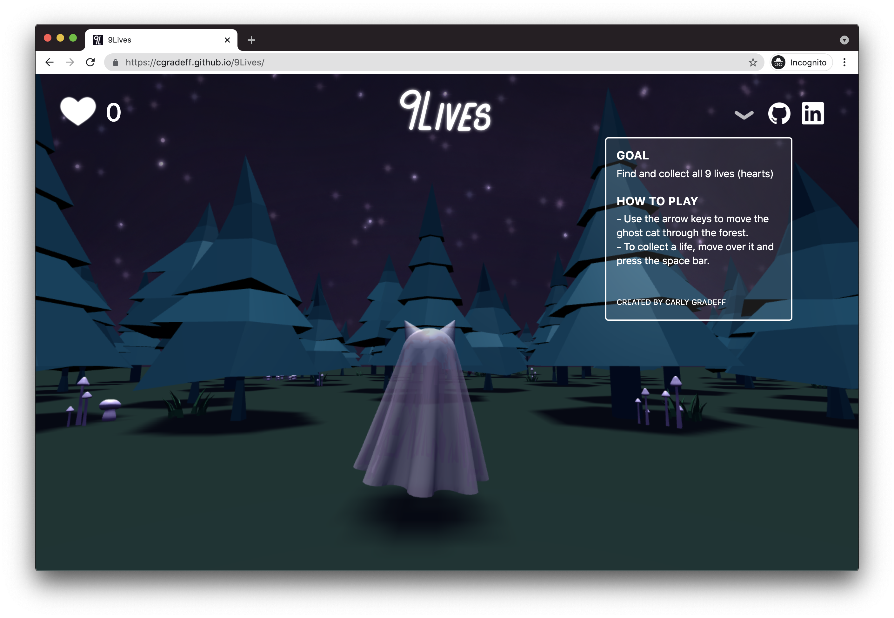

# 9Lives

### Live Link https://cgradeff.github.io/9Lives/



### Background:

This is a third person game called 9Lives. The overall concept is that you are a ghost cat and you are searching for your 9 lives in a forest to bring you back to life. You will be able to move using the arrow keys and you can pick up lives (hearts) by pressing the spacebar. 

### Functionality & MVPs:

In 9Lives, users will be able to:
- Restart the game using a button on a modal that pops up when you complete the game
- Move the character around the forest using arrow keys
- Pick lives using the space bar

#### Key Inputs
Users can move the ghost cat around the forest using arrow keys and press the spacebar to pickup lives.

```js
onKeyDown_(event) {
		const xSpeed = 0.5;
		const zSpeed = 0.5;
    switch (event.keyCode) {
       case 38: // down arrow
           this.subjects[0].ghostCat.position.z += zSpeed;
           break;
       case 40: // up arrow
           this.subjects[0].ghostCat.position.z -= zSpeed;
           break;
       case 39: // right arrow
           this.subjects[0].ghostCat.position.x -= xSpeed;
           break;
       case 37: // left arrow
           this.subjects[0].ghostCat.position.x += xSpeed;
           break;
       case 32: // spacebar
           this.checkPickUp = true;
           break;
   }
   this.render();
   this.pickupHeart();
}
 ```
#### Loaded Custom 3D Objects
Users can interact with custom 3D objects created using Vectary.

```js
loadGhostCat() {
		let loader = new OBJLoader();

        loader.load( './models/ghostCat.obj', async (object) => {
            object.traverse( (child) => {
                if (child instanceof THREE.Mesh) {
                    child.material = new THREE.MeshPhongMaterial( { color: "#fdffdb"})
					child.castShadow = true;
					child.material.transparent = true;
					child.material.opacity = 0.7; 
                }
            });
            await this.scene.add(object);
            this.ghostCat = object;
			object.scale.multiplyScalar(.15);
            object.position.set(0, .3, 0);
        }); 
}
```

### In addition, this project will include:
- A button that produces a dropdown textbox containing basic game functions
- Buttons that link to my personal sites
- A restart button
- A counter relaying the current amount of hearts collected

### Wireframes

- The links in the dropdown will include the project's Github repo and my LinkedIn
- The dropdown text box will include a brief overview of the basic game functions
- A different icon will be displayed in the top right of the navigation bar for each level, displaying the current amount of items a user has collected in that level
- The title of the game will be displayed in the center of the navigation bar
- The game canvas will take up the majority of the page 
- A button to end the game in the navigation bar (not pictured in the above wireframe) 

### Technologies, Libraries, APIs:
- three.js to render game animations
- Webpack and Babel to bundle and transpile JS code
- npm to manage project dependencies

### Implementation Timeline:
- Friday Afternoon & Weekend: Tutorials and research on three.js and getting it set up, setup project, get webpack running
- Monday: Implementation of underlying game logic, basic display set up, create all buttons and dropdown lists/text
- Tuesday: Render basic game animations and page layout, implement user controls such as moving left, right, up, down and picking up and dropping items
- Wednesday: Implement color scheme, refine animations, final styling, add the additional levels if there is time
- Thursday Morning: Project Deployment

### Bonus:

I would ideally like to have three levels of the game, the first in which you are a ghost cat, the second you are a zombie cat and the third you are just a regular (alive) cat. Each level will have a time constraint where you must collect the necessary items before the timer is up or the game ends. The goal of the first level will be to find all of your lives (or hearts) and bring them back to your body. Once your body has all of your lives, you will move onto the next level. For the second level, you will be a zombie cat and you will have to find and collect all of the flowers to “create” a potion to bring you back to life. In this level, you will have the ability to pick up other flowers that will temporarily cause you to not be able to move (affecting the remaining time you have left to complete the level). Once you have collected all the flowers, you will move onto the final level. All that you have to do in this level is find your home and once you arrive there the game is finished.

- Allow the user to customize the color of the ghost cat
- Add game music and buttons to allow the user to adjust the volume of the music
