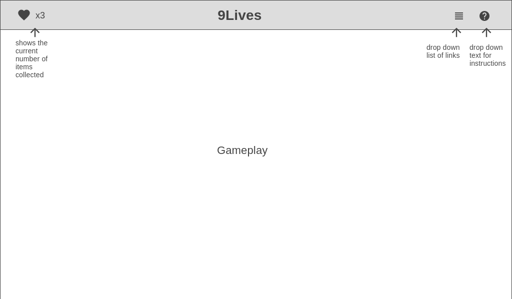

# 9Lives

### Background:

This is a third person game called 9Lives. The overall concept is that you are a ghost cat and you are searching for your 9 lives in a forest to bring you back to life. You will be able to move using the arrow keys and you can pick up and drop items using the spacebar. I would ideally like to have three levels of the game, the first in which you are a ghost cat, the second you are a zombie cat and the third you are just a regular (alive) cat. Each level will have a time constraint where you must collect the necessary items before the timer is up or the game is over. The goal of the first level will be to find all of your lives ( or hearts) and bring them back to your body. Once your body has all of your lives, you will move onto the next level. For the second level, you will be a zombie cat and you will have to find and collect all of the flowers to “create” a potion to bring you back to life. In this level, you will have the ability to pick up other flowers that will temporarily cause you to not be able to move (affecting the remaining time you have left to complete the level). Once you have collected all the flowers, you will move onto the final level. All that you have to do in this level is find your home and once you arrive there the game is finished. 

### Functionality & MVPs:

In 9Lives, users will be able to:
- Start and restart the game
- Move the character using arrow keys
- Pick up and drop items using the space bar

### In addition, this project will include:
- A help button that produces a dropdown textbox containing basic game functions
- A dropdown list containing links to my information

### Technologies, Libraries, APIs:
- three.js to render game animations
- Webpack to bundle and transpile JS code
- npm to manage project dependencies

### Implementation Timeline:
- Friday Afternoon & Weekend: Tutorials and research on three.js and getting it set up, setup project, get webpack running
- Monday: Implementation of underlying game logic, implement user controls
- Tuesday: Render basic game animations and page layout
- Wednesday: Styling, links and bonuses
- Thursday Morning: Project Deployment
